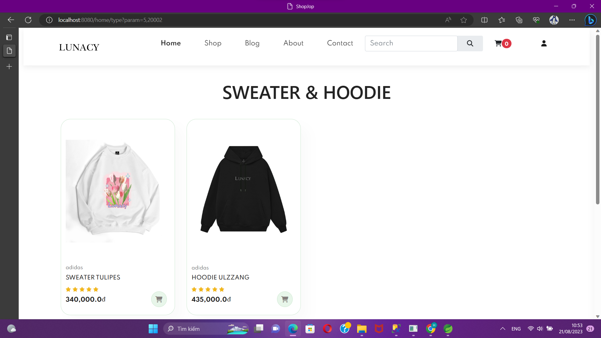
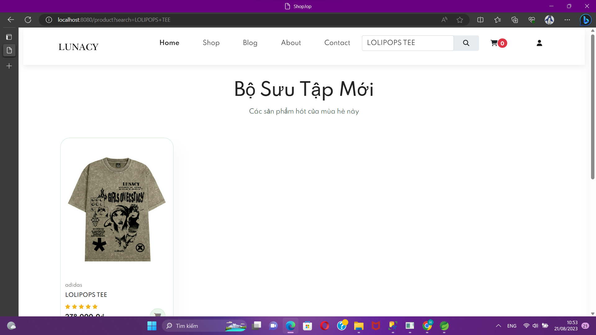
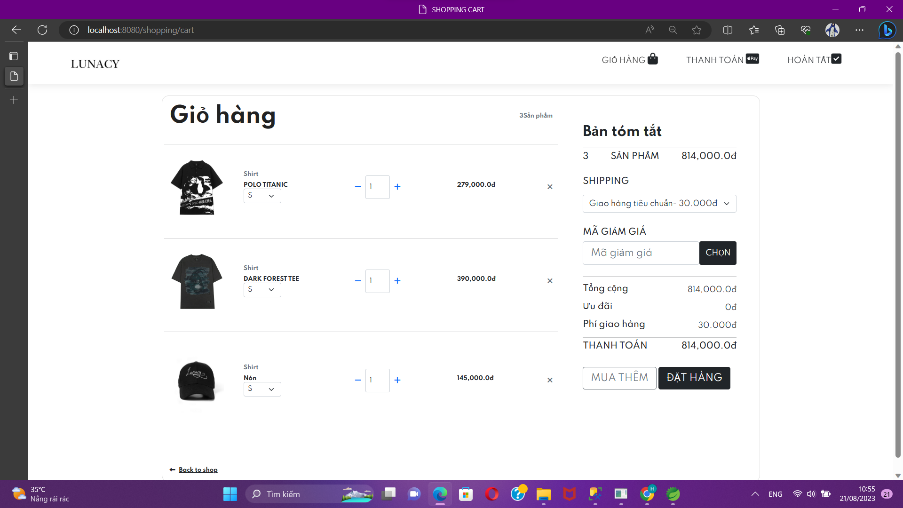
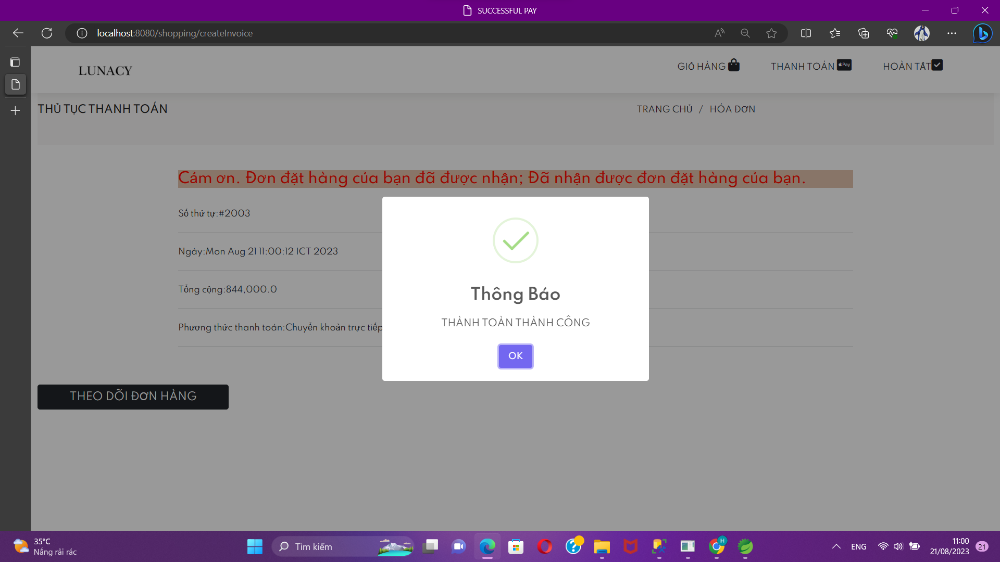
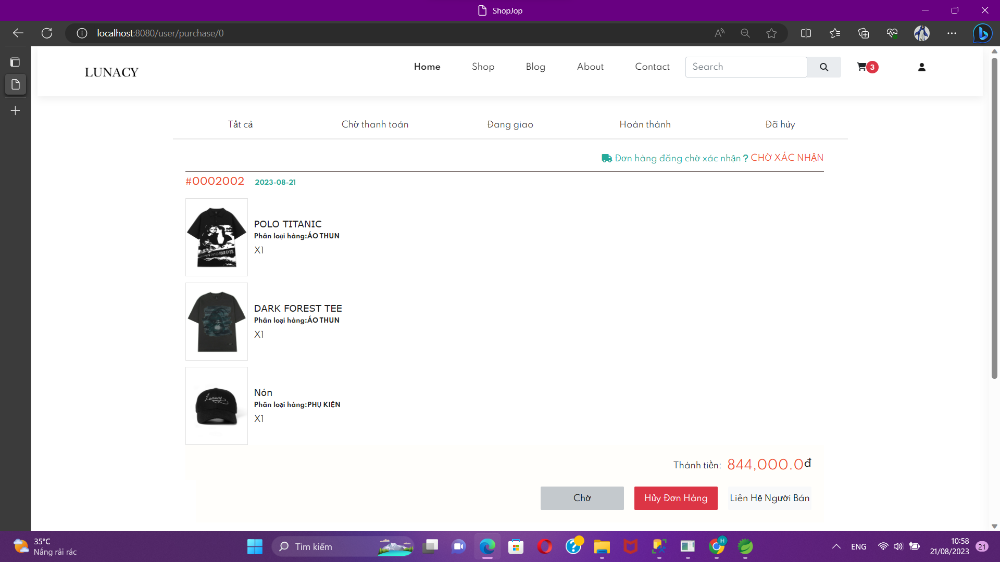
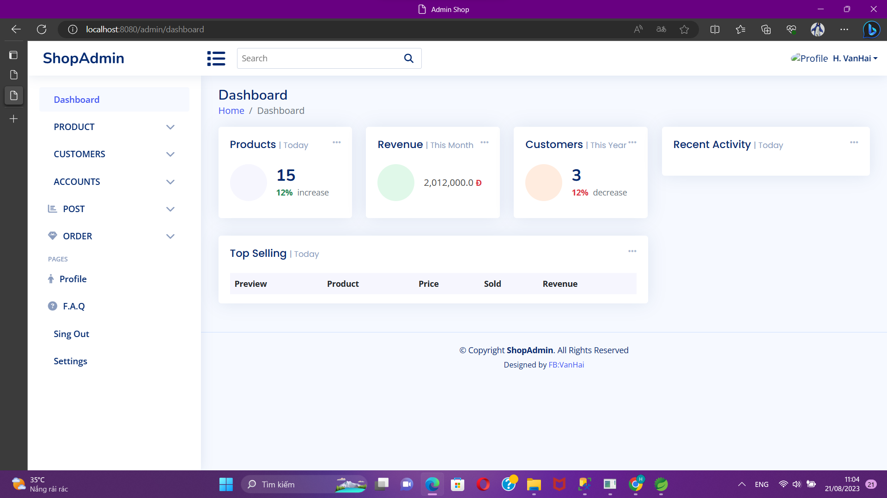
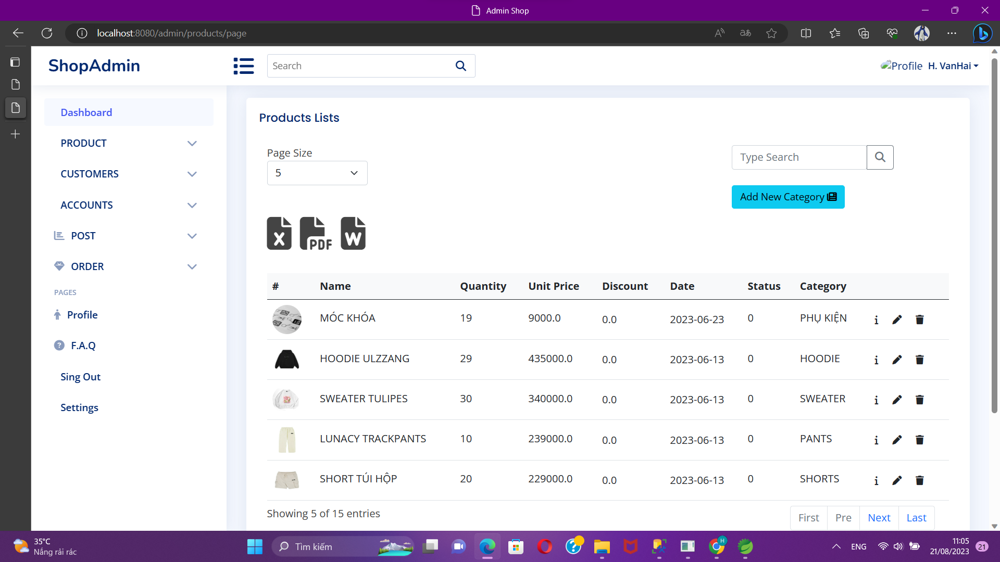
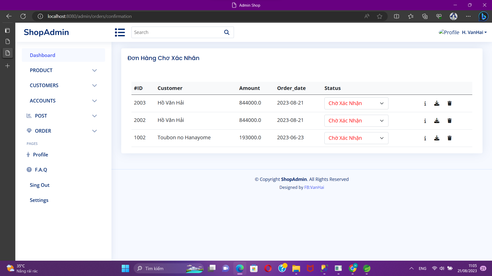
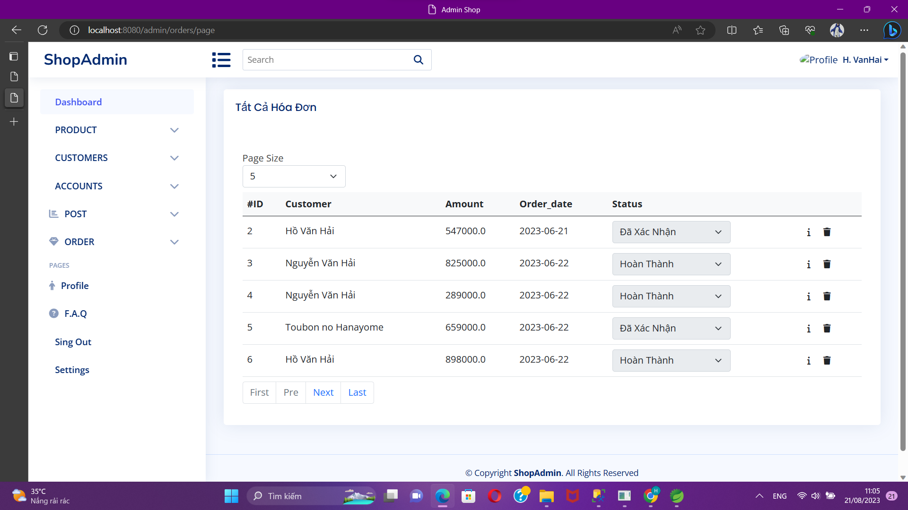

# ShopJoy-Java
This project utilizes Java and Spring Boot, along with Spring MVC, to interact with SQL using JPA Repository and various other technologies.

The website comprises two main sections: the site and the admin panel.

## Site

### HOME 

### PRODUCT LIST

### LOGIN

This is the **Login Page**, where users can sign in using their email.

### User Functions

#### Filter by Product Category

#### Search by Name

## Cart and Checkout
Products added to the cart will be displayed for checkout.

Checkout Page

After a successful order, a notification will appear, and users can track their order.

### Order Tracking

# ADMIN

## Admin Dashboard

## Product Management

Products are paginated and can be sorted. Search by product ID is also available.

## Order Confirmation and All Invoices

## Miscellaneous

### Additional Features

There are other functionalities such as CRUD operations for accounts and customers.
